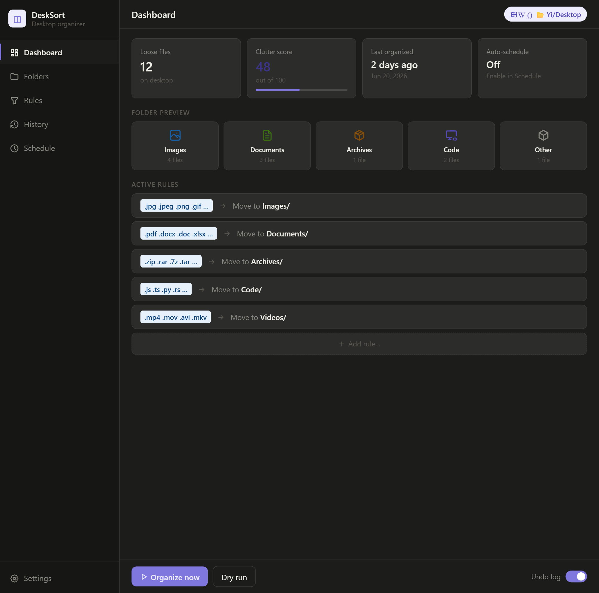

# DeskSort

**DeskSort** is a lightweight desktop organizer for Windows and macOS. It automatically sorts the files cluttering your desktop into neat folders — by file type, keyword, or rules you define yourself.

Most people end up with dozens of random files piling up on their desktop: screenshots, downloads, invoices, zip files, code snippets. DeskSort scans your desktop and moves each file into the right folder in seconds. Run it manually whenever you want, or set it on a schedule.

It's a small native app (under 6 MB), works fully offline, and never touches files outside your desktop.


---

## What it looks like



The dashboard shows your loose file count, clutter score, a folder breakdown, and your active sorting rules — all at a glance.

---

## Quick start

### macOS

**Option 1 — Homebrew**
```bash
brew tap yizhang29/desksort
brew install --cask desksort
```

**Option 2 — Direct download**
1. Go to [Releases](https://github.com/yizhang29/Desksort/releases/latest)
2. Download `DeskSort_0.1.0_universal.dmg`
3. Open it and drag DeskSort into your Applications folder
4. First launch: right-click the app → **Open** → **Open** again

> **Why does macOS warn me?** The app isn't yet notarized with Apple. Right-clicking → Open is the standard way to run trusted apps from independent developers. You only need to do this once.

### Windows

1. Go to [Releases](https://github.com/yizhang29/Desksort/releases/latest)
2. Download `DeskSort_0.1.0_x64-setup.exe`
3. Run the installer — if Windows shows a **"Windows protected your PC"** warning, click **More info → Run anyway**
4. Find DeskSort in your Start Menu and launch it

> **Why does Windows warn me?** Windows SmartScreen flags any new app that doesn't yet have a paid code signing certificate. DeskSort is safe — click "More info" then "Run anyway" to proceed. You only need to do this once.

---

## How to use

Once the app is open:

1. **Dashboard** shows how many loose files are on your desktop and a clutter score out of 100
2. Click **Dry run** to preview exactly what will move and where — nothing happens yet
3. Click **Organize now** to sort your desktop instantly
4. Go to **History** to undo any session with one click

### Add a custom rule

Go to **Rules** in the sidebar → **Add new rule**:
- Extension rule: `.psd` → `Design/`
- Keyword rule: `invoice` → `Finance/`

### Auto-schedule

Go to **Schedule** to run DeskSort automatically — daily, weekly, or on login.

---

## What it does with your files

Files are moved into a `DeskSort/` folder on your desktop:

```
Desktop/
  DeskSort/
    Images/       ← .jpg .png .gif .webp
    Documents/    ← .pdf .docx .xlsx .txt
    Archives/     ← .zip .rar .7z .tar .gz
    Code/         ← .js .py .rs .html .json
    Videos/       ← .mp4 .mov .mkv
    Other/        ← everything else
```

Your original files stay on the same drive — nothing is deleted or uploaded anywhere.

---

## Build from source

Requires [Rust](https://rustup.rs) and [Tauri CLI v2](https://tauri.app/start/prerequisites/).

```bash
git clone https://github.com/yizhang29/Desksort.git
cd Desksort
cargo tauri dev
```

No `npm install` needed — the frontend is plain HTML, CSS, and JavaScript.

---

## Releasing a new version

```bash
git add .
git commit -m "describe your change"
git push origin main
git tag v0.2.0
git push origin v0.2.0
```

GitHub Actions automatically builds and publishes the `.exe` and `.dmg`.

---

## Tech stack

| | |
|---|---|
| UI | HTML + CSS + Vanilla JS |
| Backend | Rust |
| Framework | Tauri v2 |
| Icons | Tabler Icons |
| CI/CD | GitHub Actions |

---

## License

MIT
